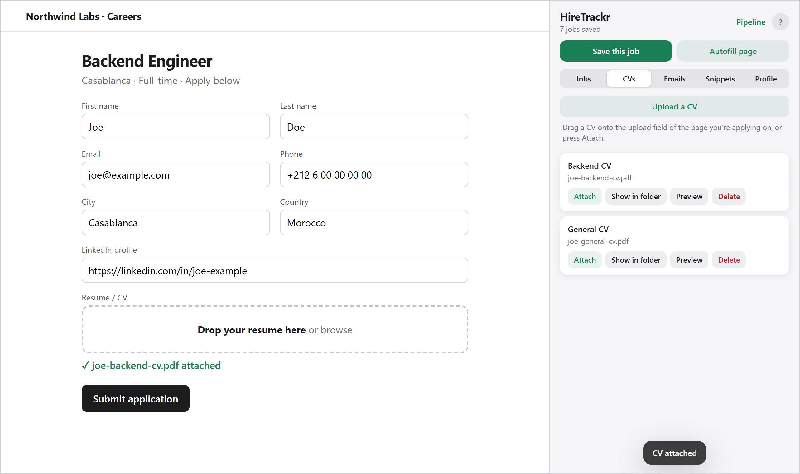
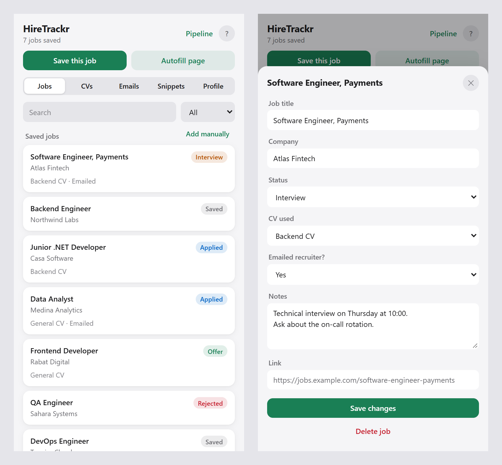
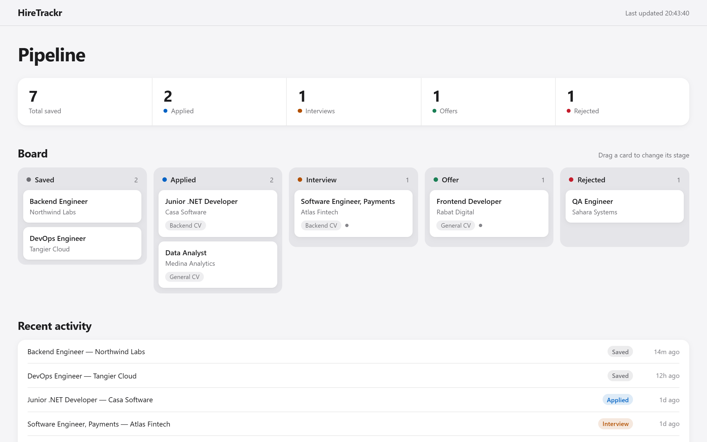
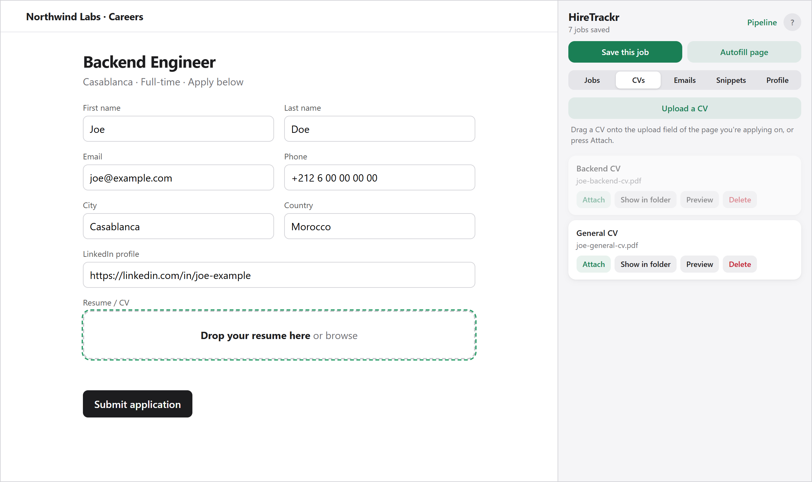
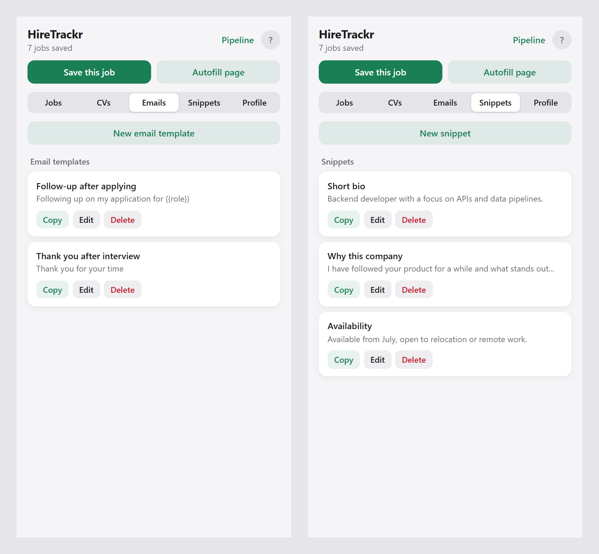
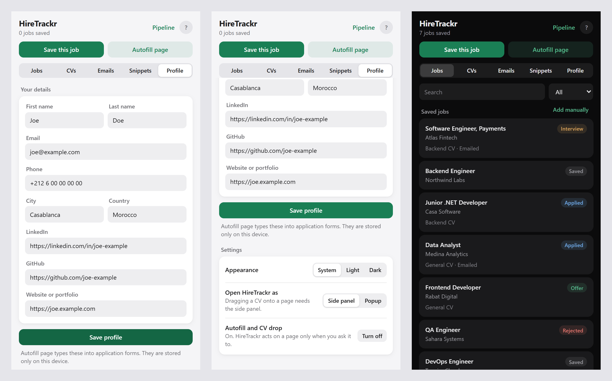

# HireTrackr

A browser extension for keeping a job search in order. It sits in the side panel and holds the jobs you
saved, where each application stands, your CV files, and a few shortcuts for the application form itself.

Everything stays in your browser. There is no account to create and no server behind it.

`Chrome extension · Manifest V3` · `plain JavaScript, HTML, CSS` · `no dependencies, no build step` ·
`chrome.storage + IndexedDB` · `GitHub Actions release`



If you came to see how it was made, the short version is under [How it is built](#how-it-is-built). The
problems met along the way, solved or not, are listed at the end in
[Notes from building it](#notes-from-building-it).

---

## Contents
- [What you can do with it](#what-you-can-do-with-it)
- [How the CV drop works](#how-the-cv-drop-works)
- [How it is built](#how-it-is-built)
- [Install it](#install-it)
- [Permissions and privacy](#permissions-and-privacy)
- [Options](#options)
- [Notes from building it](#notes-from-building-it)
- [License](#license)

---

## What you can do with it

### Save a job

Open a listing and press *Save this job*. On the larger boards (LinkedIn, Indeed, Greenhouse, Lever,
Glassdoor, Rekrute, Bayt, Wuzzuf, Akhtaboot, Emploi.ma, Workday, Ashby) the title and company are read from
the page. On other sites they come from the tab title, and you can correct them.

If a page doesn't look like a job listing, the extension asks before saving. It doesn't refuse. You can also
add a job by hand.

Each saved job keeps its stage, the CV you sent, whether you wrote to the recruiter, and your notes.



### Follow each application

The pipeline is a full-page board with five stages: Saved, Applied, Interview, Offer, Rejected. Drag a card
when something changes. Each move is recorded with its date, and the board updates on its own if you save a
job from the panel while it is open.



### Fill in the form

Enter your details once in the Profile tab. *Autofill page* then fills the matching empty fields of an
application form: name, email, phone, city, country and your links. It reads field labels in English,
French, Spanish, German and Arabic.

It leaves alone anything you already typed, and it doesn't try to answer questions about experience or
motivation. Those stay yours.

### Add your CV without the file picker

Keep your CVs (PDF or Word) in the vault. When a form asks for one, drag it from the panel onto the upload
area, or press *Attach* and let the extension find the field. While you drag, the upload area under the
pointer is outlined.



After the drop, the page holds the file as if you had picked it from your disk. Nothing is saved to your
Downloads folder. The picture at the top of this page shows the result.

A few sites accept neither the drop nor Attach. For those there is *Show in folder*: it keeps one copy of the
CV in `Downloads/HireTrackr` and opens that folder, so you can drag the file from there. The same copy is
used every time, so the folder doesn't fill with duplicates.

### Keep the texts you reuse

Email templates for follow-ups and thank-you notes, and snippets for the paragraphs you write again and
again. One click copies them.



### Take your data with you

All saved jobs export to a CSV file that opens in Excel or Google Sheets.

---

## How the CV drop works

A browser doesn't let a drag that starts inside an extension carry a file into a web page. So here the drag
is only the gesture, and the file travels separately:

```
 1. Upload once    you choose the CV; the extension keeps its own copy
 2. Drag starts    the card carries only a label; the panel tells a small script
                   inside the job page that a CV is on its way
 3. Drop           the script accepts the drop and asks the panel for the file
 4. Hand-over      the panel reads its copy and sends the bytes across
 5. Delivery       the script rebuilds the file in memory and puts it in the
                   page's upload field, where "Choose file" would have put it
```

If the page has a drop zone of its own and no upload field behind it, the file is handed to that zone
instead.

The panel answers only for the CV being dragged at that moment, and only to the tab it was dropped on. The
script on the page reacts only to a drag made by the user, not to one a page creates by itself.

---

## How it is built

```
 Side panel  (sidepanel/)                     Pipeline tab  (pipeline/)
   jobs · CVs · emails · snippets               board · counts · recent activity
   profile · settings
        │                                              │
        └──────────────── storage.js ──────────────────┘
          reads the saved list again before every write, and
          tells the other page when something changed
                          │
          chrome.storage.local   jobs, templates, snippets, profile, settings, CV names
          IndexedDB              the CV files

 Inside the job page, only when asked
   content/content.js   on known boards: reads the job title and company when you press Save
   content/apply.js     added on Autofill, Attach or a CV drag: fills fields, places the file

 background/background.js   makes the toolbar icon open the side panel or the popup
```

The side panel and the pipeline are two pages of the same extension. They don't talk to each other directly.
Both go through `storage.js`, and the browser's storage-changed event keeps them in step.

```
hiretrack/
├─ manifest.json            permissions, side panel, the list of sites for content.js
├─ storage.js               shared read-then-write layer over chrome.storage
├─ jobDetection.js          is this a job page? 214 domains, URL patterns, keywords in 7 languages
├─ theme.css                colours and controls shared by both pages, light and dark
├─ theme.js                 applies the saved appearance before the page first paints
├─ background/background.js service worker: toolbar icon → side panel or popup
├─ content/content.js       title and company on a dozen job boards
├─ content/apply.js         autofill, upload-field detection, CV attach and CV drop
├─ sidepanel/               the main screen (also used as the popup)
├─ pipeline/                the full-page board
├─ icons/
├─ docs/screenshots/        the pictures on this page
└─ .github/workflows/release.yml   zips the extension and publishes a release
```

A few choices that shaped it:

- **No server.** A job search is personal. Keeping it in the browser means there is nothing to leak and
  nothing to pay for. The price is that it doesn't sync between devices.
- **No dependencies, no build step.** The folder in this repository is the extension. Every line that runs
  can be read here.
- **A script on the page only when you ask.** `apply.js` is added at the moment you press Autofill or Attach,
  or start dragging a CV. It isn't running on the pages you visit otherwise.
- **Side panel first.** A popup closes when you click outside it, so it can't stay open while you fill a form.

---

## Install it

**From a release**
1. Download the latest `hiretrackr-vX.Y.zip` from [Releases](https://github.com/rows-w1z4rd/hiretrack/releases)
   and unzip it somewhere you will keep it.
2. Open `chrome://extensions` (or `edge://extensions`) and turn on **Developer mode**.
3. Click **Load unpacked** and choose the unzipped folder.
4. Pin HireTrackr from the puzzle-piece menu and click its icon.

**From source**: clone the repository and load the folder the same way. After changing code, press the reload
arrow on the extension's card.

It needs Chrome or Edge 123 or newer. An extension installed this way doesn't update itself; to update,
unzip the new version over the same folder and press reload.

---

## Permissions and privacy

| Permission | What it is for |
|---|---|
| `storage` | your jobs, templates, snippets, profile and settings |
| `tabs` | reading the address and title of the tab you are saving |
| `sidePanel` | showing the panel beside the page |
| `scripting` | adding `apply.js` to a page when you use Autofill, Attach or the CV drop |
| access to sites (optional) | asked the first time you use Autofill or the CV drop, and can be turned off again |
| `downloads` (optional) | asked the first time you press *Show in folder*, to keep one copy of a CV in your Downloads folder |

The extension makes no network requests of its own. There is no analytics and no telemetry.

---

## Options

Under Profile you'll find the details Autofill uses and a few settings: light, dark or the system's
appearance; side panel or the classic popup; and the switch that lets the extension work on pages.



---

## Notes from building it

A short record of what went wrong and what was done about it, including what is still open.

### Fixed

| Problem | What was done |
|---|---|
| Saved jobs could disappear | The panel and the pipeline each kept their own copy of the list and wrote the whole list back. Saving a job in one, then dragging a card in the other, erased the new job. Both now go through one file that reads the stored list again before every write. |
| "Not a job page" | The detector refused pages it didn't recognise, including some real listings. It now only decides whether to ask first, and jobs can be added by hand. |
| Title and company often wrong | The page sent them when it loaded, but the extension listened only while it was open, so the message was usually missed. The panel now asks the page at the moment you press Save. |
| Dragging a CV onto a page | The first version put the file on the drag itself, which browsers don't allow from an extension. For a while the workaround was to download the CV again each time. The current approach is described above. |
| Sites that take neither the drop nor Attach | Such a site only accepts a real file dragged by the user. *Show in folder* keeps one copy of the CV in the Downloads folder and opens it, so the file can be dragged from there. |
| Drops landing on the wrong field | An early version searched for "the nearest upload field" by walking up the page, and on some layouts reached an unrelated one. It now uses only the field under the pointer. |
| The popup kept closing | It couldn't stay open during an application or be the start of a drag. The side panel replaced it, and the popup stayed as an option. |
| Silent failures | When permission was missing, or the page was one no extension may touch, nothing happened. The panel now says what went wrong. |
| Stage changes recorded only sometimes | One of the three ways to change a stage wrote to the history. All three do now. |
| A refresh button that did nothing | Its click handler was blocked by the extension's own security policy. The board updates by itself now and the button is gone. |
| Files accepted by name | Any file renamed to `.pdf` passed as a CV. Uploads are checked by their first bytes. |
| Permissions that weren't used | Two were requested and never needed. They were removed. |

### Not fixed

| What | Why it stays |
|---|---|
| A drag can't carry the file itself | This is a browser rule. Everything described above is a way around it, not a fix. |
| The browser's own pages | The New Tab page, settings and the Web Store are closed to every extension. |
| Autofill beyond contact details | Work history, education and a site's own questions need more than matching labels. |
| The detector is cautious | Some real listings still get the "Save anyway?" question. |
| Title and company on other sites | Outside the dozen known boards they come from the tab title. On a tab that was open before the extension was installed, the page has to be reloaded first. |
| Few real sites tested | It was checked on practice forms and a handful of sites. Application systems differ, and some will behave differently. |
| Filling the profile from a CV | It would need a PDF library, which would be the first dependency. Not built. |
| Sync and automatic updates | Left out with the server. CSV export covers moving to another device. |

---

## License

[PolyForm Noncommercial 1.0.0](LICENSE). You may read it, run it and change it for your own use. You may not
sell it or use it commercially. Copyright © 2026 rows-w1z4rd.
